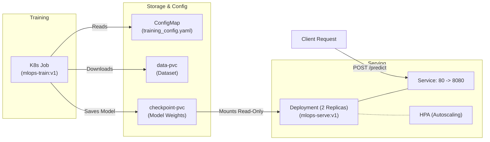

# PyTorch MLOps Pipeline: Training, Docker & Kubernetes

This repository contains an end-to-end machine learning pipeline for classifying CIFAR-10 images with PyTorch (ResNet-18). It covers the full lifecycle from local model training to containerization with Docker multi-stage builds and deployment on Kubernetes (Minikube).

---

## 🏗️ Architecture



---

## 📂 Project Structure

```text
mlops-pytorch-pipeline/
├── .github/workflows/ci.yml       # Automated lint, test, and docker build workflow
├── configs/training_config.yaml   # Hyperparameters & paths
├── docker/
│   ├── Dockerfile.train           # Multi-stage training image
│   └── Dockerfile.serve           # Slim inference image (non-root user, healthcheck)
├── k8s/
│   ├── namespace.yaml             # ml-training namespace
│   ├── configmap.yaml             # Mounted training configuration
│   ├── pvc.yaml                   # Persistent storage for data & checkpoints
│   ├── training-job.yaml          # Batch training job (with GPU support toggle)
│   ├── serving-deployment.yaml    # 2-replica serving deployment with probes
│   ├── serving-service.yaml       # ClusterIP service
│   └── hpa.yaml                   # Horizontal pod autoscaler
├── requirements/
│   ├── train.txt                  # Dependencies for training
│   └── serve.txt                  # Lightweight dependencies for inference
├── src/
│   ├── dataset.py                 # CIFAR-10 transforms and DataLoader
│   ├── model.py                   # ResNet-18 and SimpleCNN architectures
│   ├── train.py                   # Training loop with JSON logging & early stopping
│   └── serve.py                   # FastAPI app (POST /predict, GET /health)
├── tests/test_model.py            # Unit tests for model, data, and API
└── README.md
```

---

## ⚡ Getting Started Locally

### 1. Installation
```bash
python -m venv venv
# On Windows: .\venv\Scripts\activate | On Linux/macOS: source venv/bin/activate
pip install -r requirements/train.txt -r requirements/serve.txt
```

### 2. Run Tests & Local Scripts
```bash
# Run unit tests
pytest tests/ -v

# Train locally
python src/train.py

# Run FastAPI server
uvicorn src.serve:app --host 0.0.0.0 --port 8080
```

---

## 🐳 Docker Containerization

### 1. Build the Images
```bash
# Training image
docker build -f docker/Dockerfile.train -t mlops-train:v1 .

# Serving image
docker build -f docker/Dockerfile.serve -t mlops-serve:v1 .
```

### 2. Run Containers with Volume Mounts

```bash
# Run training (saves weights to ./checkpoints)
docker run --rm -v "${PWD}/data:/app/data" -v "${PWD}/checkpoints:/app/checkpoints" mlops-train:v1

# Run serving
docker run --rm -p 8080:8080 -v "${PWD}/checkpoints:/app/checkpoints" mlops-serve:v1
```

### 3. Test Prediction Endpoint
```bash
# Health check
curl http://localhost:8080/health

# Prediction
curl -X POST http://localhost:8080/predict -F "image=@test_image.png"
```

---

## ☸️ Kubernetes Deployment (Minikube)

### 1. Start Minikube & Load Images
```bash
minikube start
minikube image load mlops-train:v1
minikube image load mlops-serve:v1
```

### 2. Apply Storage, Config & Run Training Job
```bash
kubectl apply -f k8s/namespace.yaml
kubectl apply -f k8s/configmap.yaml
kubectl apply -f k8s/pvc.yaml

# Run the training Job and stream logs
kubectl apply -f k8s/training-job.yaml
kubectl logs -f job/pytorch-training-job -n ml-training
```

### 3. Deploy Model Serving & Test
```bash
# Deploy 2-replica serving, service, and HPA
kubectl apply -f k8s/serving-deployment.yaml
kubectl apply -f k8s/serving-service.yaml
kubectl apply -f k8s/hpa.yaml

# Check pods status
kubectl get pods -n ml-training

# Port-forward and send a test request
kubectl port-forward svc/model-serving 8080:80 -n ml-training
curl -X POST http://localhost:8080/predict -F "image=@test_image.png"
```

---

## 💡 Reflection & Challenges Faced

Working through this assignment provided practical hands-on experience in taking a deep learning workflow out of Jupyter notebooks into a production-grade infrastructure setup. A few key challenges and learnings stood out:

### 1. Keeping Container Images Lean and Fast
Initially, training and serving containers can easily balloon to several gigabytes because standard PyTorch distributions include large CUDA toolkits. To solve this, we used multi-stage builds and pulled CPU-optimized wheels for local inference. Additionally, by separating `requirements/train.txt` and `requirements/serve.txt`, the serving container was kept minimal and fast to start, avoiding unnecessary training dependencies like profilers or large dataset utilities.

### 2. Volume Sharing Between Batch Jobs and Serving Replicas
One tricky aspect was managing the lifecycle of model weights between the training stage and the serving stage. In Kubernetes, the training workload runs as a transient `Job`, which needs write access to save `classifier_v1.pt`. Once trained, multiple replicas of the serving `Deployment` need to read that exact checkpoint simultaneously. Using a shared Persistent Volume Claim (`checkpoint-pvc`) with read-only mounting on the serving pods ensured that all replicas consistently load the latest trained weights without write locks or race conditions.

### 3. Health Probes and Cold Starts
Deep learning containers often take a few seconds on startup to load neural network weights into memory. Setting the Kubernetes readiness probe without an initial delay caused pods to fail health checks during model initialization. Adding a 15-second `initialDelaySeconds` and pairing it with a rolling update strategy (`maxSurge: 1, maxUnavailable: 0`) ensured zero dropped requests during updates.

### 4. Configuration Decoupling
Hardcoding hyperparameters inside training scripts makes testing variations tedious. Decoupling hyperparameters into `configs/training_config.yaml` and mounting them via a Kubernetes `ConfigMap` made it straightforward to change learning rates or batch sizes without needing to rebuild and re-push Docker images.
